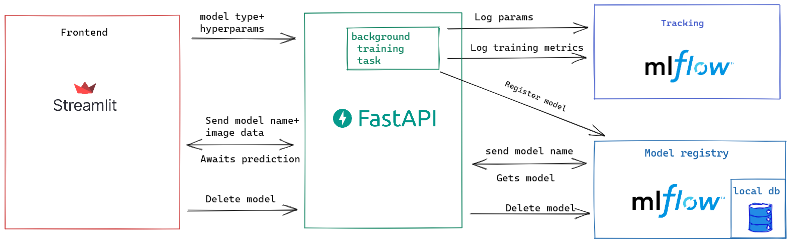
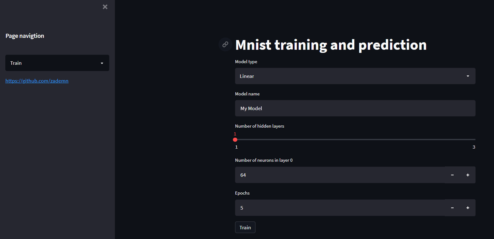
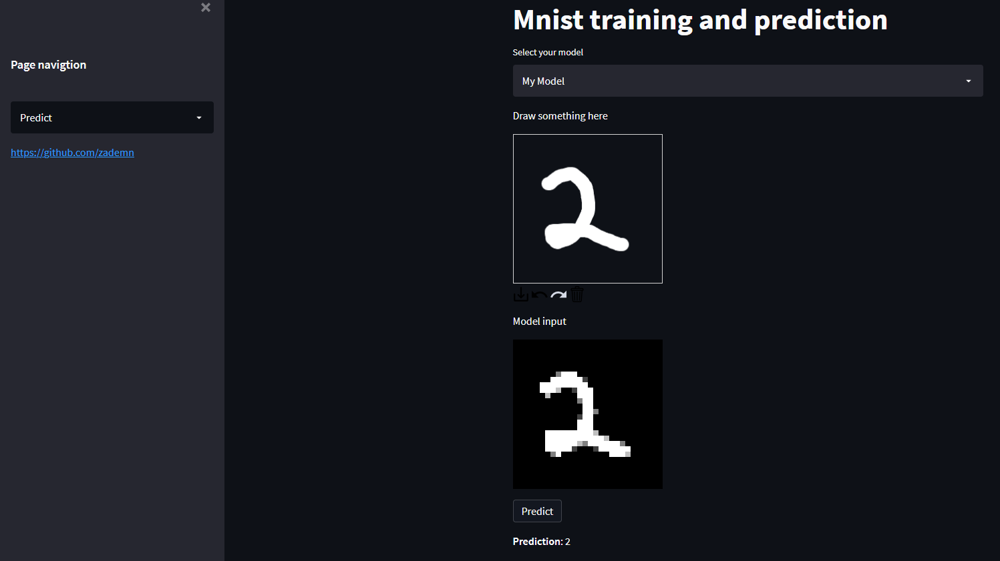

# Partie : 1 - Configurer un environnement Docker et déployer une application sur une instance EC2 d'AWS

Ce guide détaille les étapes pour configurer un environnement Docker et déployer une application sur une instance EC2 d'AWS.

```bash
# Choisir une instance EC2 de type t2.2xlarge avec 8 CPU, 32 Go de RAM et 50 Go de volume de stockage.

# Se connecter à votre instance EC2 :
ssh ubuntu@VOTRE-IP-publique

# Passer en mode superutilisateur :
sudo -s

# Cloner le script d'installation de Docker :
git clone https://github.com/hrhouma/install-docker.git

# Naviguer vers le répertoire `install-docker` :
cd install-docker/

# Rendre le script d'installation exécutable :
chmod +x install-docker.sh

# Exécuter le script d'installation :
./install-docker.sh

# Mettre à jour la liste des paquets :
sudo apt-get update -y

# Revenir au répertoire de l'utilisateur :
cd ..

# Installer Docker Compose :
apt install docker-compose -y

# Vérifier la version de Docker Compose :
docker-compose --version

# Cloner le dépôt de l'application :
git clone https://github.com/hrhouma/mnist-mlops-streamlit.git

# Naviguer vers le répertoire `mnist-mlops-streamlit` :
cd mnist-mlops-streamlit

# Construire les images Docker :
docker-compose build

# Lancer les conteneurs Docker en mode détaché :
docker-compose up -d

# Essayez d'accéder à l'application en utilisant les URLs suivantes :
# Interface utilisateur Streamlit : http://ec2-35-153-79-164.compute-1.amazonaws.com:8501/
# API Backend : http://ec2-35-153-79-164.compute-1.amazonaws.com:5000/
# Documentation de l'API : http://ec2-35-153-79-164.compute-1.amazonaws.com:8000/docs#/

# Pour surveiller les journaux des conteneurs Docker, utilisez :
docker-compose logs -t -f --tail 5
```

# Références : 
- https://github.com/zademn/mnist-mlops-learning/tree/master
- https://www.linkedin.com/pulse/mlops-task-3-integrating-machine-learning-devops-rupali-gurjar/
- https://www.youtube.com/watch?v=1LbdHnOZch8&ab_channel=BhupendraKumar
- https://github.com/bhupendrak9917/My-AI-Projects/tree/main/MNIST_Streamlit

# Partie : 2 - TO DO

```bash
python -m streamlit run frontend/streamlit_main.py
uvicorn backend.main:app --host 0.0.0.0 --port 8000
mlflow ui --backend-store-uri sqlite:///db/backend.db --host 0.0.0.0 --port 5000


### Solution 2: Use Python Virtual Environment for Docker Compose

1. **Install `pip` if it's not already installed:**
   ```sh
   sudo apt-get update
   sudo apt-get install -y python3-pip
   ```

2. **Create a Python virtual environment and activate it:**
   ```sh
   sudo apt-get install -y python3-venv
   python3 -m venv docker-compose-venv
   source docker-compose-venv/bin/activate
   ```

3. **Install Docker Compose within the virtual environment:**
   ```sh
   pip install docker-compose
   ```

4. **Use Docker Compose from the virtual environment:**
   ```sh
   docker-compose --version
   ```

### Additional Steps to Execute Your Project

1. **Navigate to your project directory:**
   ```sh
   cd /home/ubuntu/mnist-mlops-learning
   ```

2. **Build the Docker images:**
   ```sh
   docker-compose build
   ```

3. **Start the services:**
   ```sh
   docker-compose up -d
   ```

4. **Check the logs to ensure everything is running correctly:**
   ```sh
   docker-compose logs
   ```

By following these steps, you should be able to build and run your Docker containers on your EC2 instance without encountering the `ssl_version` error.

---------
# Fastapi + MLflow + streamlit

Setup env. I hope I covered all.
```bash
pip install -r requirements.txt
```
# Start app
Go in the root dir and run these

Streamlit
```bash
streamlit run frontend/streamlit_main.py
```

FastAPI 
```
uvicorn backend.main:app
```

MLflow UI
```bash
mlflow ui --backend-store-uri sqlite:///db/bakckend.db
```

## Docker
- Mlflow: http://localhost:5000
- FastApi: http://localhost:8000/docs
- Streamlit: http://localhost:8501/

```bash
docker-compose build
docker-compose up
```

# Architecture


# UI 




## TODO
- [x] Dockerize
- [ ] Testing
- [ ] Maybe add celery instead of that background task? (Needs extra configs though)

